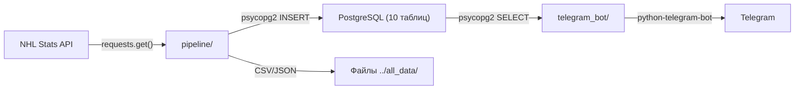
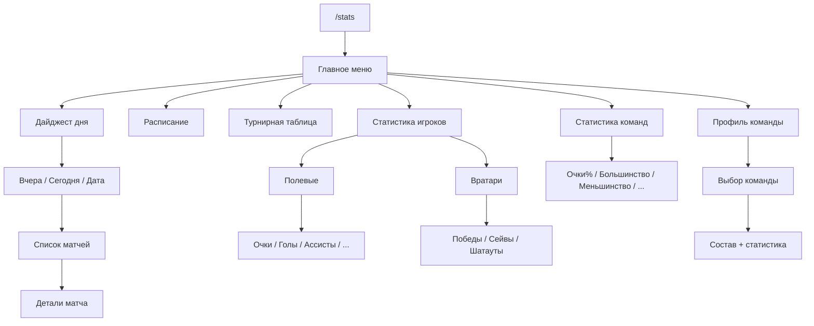
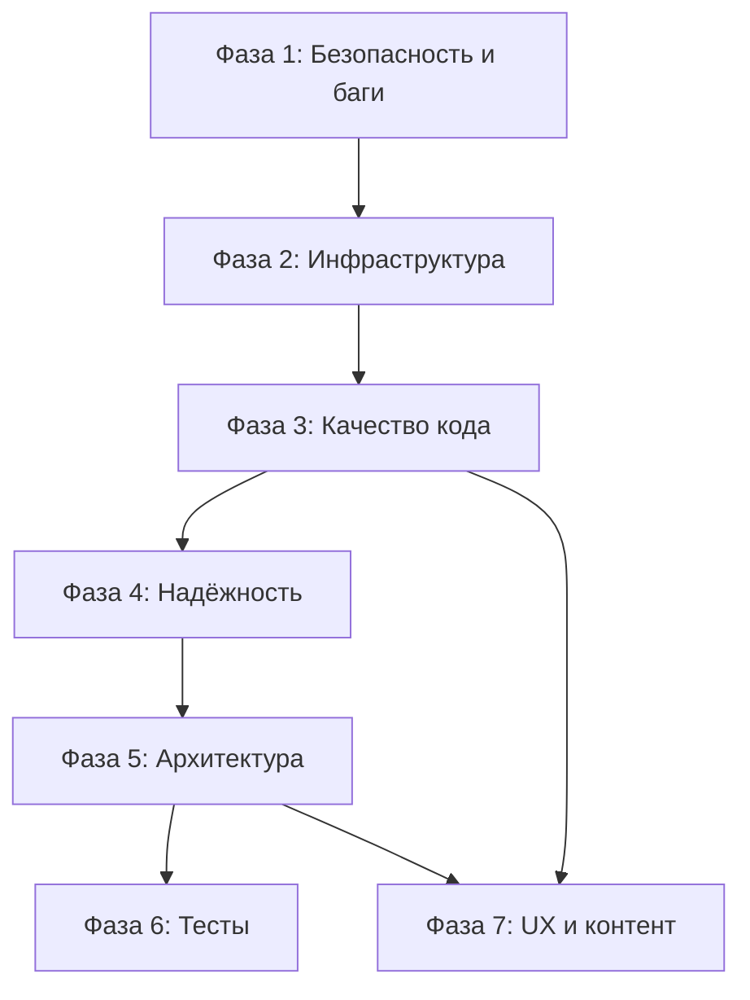

# Анализ и план рефакторинга NHL_bot

## Архитектура проекта



### Структура файлов

```
NHL_bot/
├── README.md
├── data_tables/                    # DDL-скрипты (10 таблиц)
│   ├── t.games.sql, t.all_goals.sql, t.teams.sql, ...
├── pipeline/                       # ETL-пайплайн
│   ├── config.py                   # Конфигурация (DB, API, даты)
│   ├── columns.py                  # Определения колонок DataFrame
│   ├── functions.py                # Вызовы NHL API + парсинг
│   ├── pipeline.py                 # Главный ETL-скрипт
│   ├── postgres_nhl.py             # Хелперы для работы с PostgreSQL
│   ├── teams_and_players.py        # Загрузка команд/игроков
│   └── start.sh                    # Точка запуска пайплайна
└── telegram_bot/                   # Telegram-бот
    ├── bot.py                      # Entry point бота
    ├── script_bot.py               # Обработчики главного меню
    ├── bot_messages.py             # Построение сообщений
    ├── sql_query.py                # SQL-запросы к PostgreSQL
    ├── template_funcs.py           # Jinja2-шаблонизация
    ├── dialog_states.py            # Состояния диалога + константы
    ├── buttons.py                  # Неиспользуемый файл
    ├── player_stats_functions.py   # Обработчики статистики игроков
    ├── goalie_stats_functions.py   # Обработчики статистики вратарей
    ├── team_stats_functions.py     # Обработчики статистики команд
    ├── day_digest.py               # Дайджест дня
    ├── messages/*.txt              # Jinja2-шаблоны
    └── queries/*.sql               # SQL-функции для PostgreSQL
```

---

## Плюсы проекта

- **Рабочий MVP**: проект решает задачу — данные загружаются из NHL API, сохраняются в PostgreSQL и отображаются через Telegram-бота
- **Разделение на модули**: pipeline и telegram_bot логически разделены
- **Использование PostgreSQL**: надёжная СУБД с хранимыми функциями для сложных запросов
- **Jinja2-шаблоны**: сообщения бота формируются через шаблоны, а не хардкодятся
- **ConversationHandler**: корректное использование FSM для навигации по меню бота
- **SQL-функции в отдельных файлах**: DDL и SQL-функции вынесены в `.sql`-файлы
- **Pandas для обработки данных**: удобная трансформация данных перед загрузкой в БД

---

## Минусы и проблемы

### Критические

1. **SQL-инъекции** — в `pipeline/postgres_nhl.py`, `telegram_bot/sql_query.py`, `telegram_bot/bot_messages.py` все SQL-запросы собираются через f-строки и конкатенацию
2. **Захардкоженный API-ключ Telegram** — в `telegram_bot/buttons.py` (строка 3): `API_KEY = "1139367179:AAGA..."`
3. **Логический баг в определении победителя** — в `pipeline/functions.py` (строка ~107): сравниваются голы домашней команды с голами домашней (вместо гостевой)
4. **Копипаст-баги в обработчиках** — в `telegram_bot/player_stats_functions.py`: `bot_player_plus_minus` показывает хиты, `bot_player_penalties` показывает +/-

### Серьёзные

5. **Нет `requirements.txt`** — невозможно воспроизвести окружение
6. **Нет `.gitignore`** — потенциальная утечка конфигов и данных
7. **Нет обработки ошибок HTTP** — `requests.get()` без `try/except`, без retry, без таймаутов
8. **Bare `except:`** — ловят все исключения и только печатают, не перебрасывают
9. **Нет конфига для бота** — `config.TOKEN` используется, но `telegram_bot/config.py` отсутствует в репозитории
10. **`from module import *`** — star-импорты в нескольких файлах (`pipeline/pipeline.py`, `telegram_bot/bot.py`, `telegram_bot/player_stats_functions.py`)

### Умеренные

11. **Дублирование кода** — обработчики `bot_player_*`, `bot_goalie_*`, `bot_team_*` идентичны по структуре, отличаются только параметрами
12. **Debug-код в проде** — `print()` вместо логирования, `print(game_message(2022020434))` выполняется при импорте `bot_messages.py`
13. **Нет тестов** — ни одного теста во всём проекте
14. **Нет Docker** — нет Dockerfile, docker-compose
15. **Нет CI/CD** — нет GitHub Actions, GitLab CI или аналогов
16. **Захардкоженные даты** — `DATE_FROM`, `DATE_TO`, дефолт `'2022-12-10'` в day_digest
17. **Захардкоженные ID команд** — `ALL_ID_TEAMS` не обновляется автоматически
18. **Нет rate-limiting** для NHL API — могут заблокировать
19. **Несоответствие схемы** — `winner_team_id` в коде vs `winner_id` в DDL
20. **Файл `buttons.py` не используется** — мёртвый код с другим фреймворком (`telegram_menu`)
21. **Относительные пути** — `../all_data/...` привязывают к рабочей директории
22. **Нет кэширования** — каждый запрос бота бьёт в БД
23. **Соединения с БД не закрываются** — нет `with` / `finally` / context manager

---

## Подробный план рефакторинга

### Фаза 1: Безопасность и критические баги

**1.1. Устранение SQL-инъекций**

- `pipeline/postgres_nhl.py`: заменить f-строки на параметризованные запросы (`%s` placeholders) для значений; для имён таблиц/колонок использовать whitelist
- `telegram_bot/sql_query.py`: `generate_query()` — использовать `psycopg2.sql` модуль для безопасной подстановки идентификаторов
- `telegram_bot/bot_messages.py`: все `f"...{column_name}..."` заменить на `psycopg2.sql.Identifier`

**1.2. Вынос секретов в переменные окружения**

- Создать единый конфиг через `python-dotenv` + `.env` файл
- Создать `.env.example` с описанием всех переменных
- Удалить захардкоженный токен из `telegram_bot/buttons.py`
- Объединить конфиги pipeline и telegram_bot в один модуль

**1.3. Исправление логических багов**

- `pipeline/functions.py` строка ~107: заменить `home > home` на `home > away` при определении победителя
- `telegram_bot/player_stats_functions.py`: исправить `bot_player_plus_minus` (использует `'hits'` вместо `'plus_minus'`) и `bot_player_penalties` (использует `'plus_minus'` вместо `'pim'`)
- `telegram_bot/script_bot.py` строка ~86: `PLAYER_GOALS` → `PLAYER_GOALIE`
- `telegram_bot/messages/game_message.txt`: `{{ time }}` → `{{ goal['time'] }}`

### Фаза 2: Инфраструктура проекта

**2.1. Создать `requirements.txt`**

```
requests
pandas
psycopg2-binary
python-telegram-bot
jinja2
python-dotenv
```

**2.2. Создать `.gitignore`**

- `*.pyc`, `__pycache__/`, `.env`, `../all_data/`, `*.csv`, `*.json` (данные)

**2.3. Создать `Dockerfile` и `docker-compose.yml`**

- Сервис для бота, сервис для pipeline (cron или scheduled task), PostgreSQL

**2.4. Создать GitHub Actions CI**

- Линтинг (flake8/ruff), тайп-чекинг (mypy), тесты (pytest)

### Фаза 3: Качество кода

**3.1. Замена `print()` на `logging`**

- Настроить `logging.basicConfig()` с уровнями DEBUG/INFO/WARNING/ERROR
- Удалить все `print()` из production-кода
- Удалить debug-вызов `print(game_message(2022020434))` из `bot_messages.py`

**3.2. Устранение star-импортов**

- Заменить `from module import *` на явные импорты во всех файлах

**3.3. Удаление мёртвого кода**

- Удалить `telegram_bot/buttons.py` — не используется и содержит захардкоженный токен
- Убрать закомментированный код (`reply_markup`, `PG_PASSWORD`, `logging`, `argparse`)
- Удалить неиспользуемый импорт `os` из `pipeline/config.py`

**3.4. Добавление type hints**

- Добавить аннотации типов ко всем функциям
- Исправить некорректные (`-> json` → `-> dict`)

**3.5. Устранение дублирования обработчиков**

- Создать фабричную функцию для генерации `bot_player_*`, `bot_goalie_*`, `bot_team_*`:

```python
def create_stat_handler(stat_name: str, table: str, column: str, label: str):
    def handler(update, context):
        text = player_stats(label, table, column)
        keyboard = [[InlineKeyboardButton("Ещё статистику", callback_data=str(CHOOSE_STATS))]]
        update.callback_query.answer()
        update.callback_query.edit_message_text(text=text, reply_markup=InlineKeyboardMarkup(keyboard))
        return FIRST
    return handler
```

### Фаза 4: Надёжность

**4.1. Обработка ошибок HTTP**

- Обернуть все `requests.get()` в retry-логику (библиотека `tenacity` или `urllib3.util.retry`)
- Добавить таймауты: `requests.get(url, timeout=30)`
- Проверять `response.raise_for_status()`

**4.2. Обработка ошибок БД**

- Использовать context managers для соединений: `with psycopg2.connect(...) as conn:`
- Заменить bare `except:` на конкретные исключения (`psycopg2.Error`, `KeyError`, и т.д.)
- Добавить rollback при ошибках

**4.3. Rate-limiting для NHL API**

- Добавить `time.sleep(0.5)` между запросами или использовать `ratelimit` библиотеку

**4.4. Динамические даты**

- Заменить захардкоженные `DATE_FROM`/`DATE_TO` на аргументы CLI или `datetime.today()`
- `day_digest()` — использовать текущую дату по умолчанию

### Фаза 5: Архитектурные улучшения

**5.1. Единый конфиг-модуль**

- Создать корневой `config.py` (или `settings.py`) с загрузкой из `.env`
- Общие параметры (DB, пути) доступны и pipeline, и боту

**5.2. Модуль для работы с БД**

- Создать единый `database.py` с connection pool (`psycopg2.pool`) или использовать SQLAlchemy
- Context manager для транзакций
- Общий для pipeline и бота

**5.3. Модуль для NHL API**

- Выделить `nhl_api_client.py` с retry, rate-limiting, валидацией ответов
- Использовать `requests.Session()` для переиспользования соединений

**5.4. Кэширование**

- Добавить in-memory кэш (например, `functools.lru_cache` или `cachetools`) для часто запрашиваемых данных бота (таблица лиги, лидеры — обновляются раз в день)

**5.5. Согласование схемы**

- Привести в соответствие имена колонок между кодом и DDL (`winner_team_id` vs `winner_id`)
- Добавить миграции (Alembic) или версионирование схемы

### Фаза 6: Тесты и документация

**6.1. Тесты**

- Unit-тесты для `functions.py` (парсинг данных API)
- Unit-тесты для `bot_messages.py` (формирование сообщений)
- Integration-тесты для `postgres_nhl.py` (с тестовой БД)
- Мок NHL API для тестов пайплайна

**6.2. Документация**

- Обновить README: описание проекта, инструкции по установке и запуску, переменные окружения
- Добавить docstrings к публичным функциям

---

## Фаза 7: Улучшения продукта — информативность, UX и контент

### 7.1. Текущие проблемы UX

Сейчас бот имеет ряд серьёзных UX-проблем:

- **Тупик после просмотра статистики**: `reply_markup` закомментирован во всех обработчиках — пользователь видит текст, но кнопки навигации ("В главное меню", "Хватит") не отображаются. Единственный выход — заново набрать `/stats`
- **Дайджест дня захардкожен на 2022-12-10** — пользователь не может выбрать дату и не видит актуальных игр
- **Турнирная таблица (`team_table()`) существует в коде, но недоступна из меню** — функция написана, но не привязана ни к одной кнопке
- **Непонятное приветствие**: "Запустите обработчик, выберите маршрут" — техническое сообщение вместо дружелюбного приветствия
- **Нет подсказок и контекста** — пользователь получает сухие таблицы без объяснения, что они значат
- **Смешение языков**: "See you next time!" на английском при полностью русскоязычном интерфейсе

### 7.2. Навигация и управление

**Исправить кнопки навигации (критично)**

- Раскомментировать `reply_markup` во всех обработчиках (`player_stats_functions.py`, `goalie_stats_functions.py`, `day_digest.py`)
- Унифицировать callback кнопки: сейчас goalie-обработчики ведут на `TEAM_STATS` вместо `CHOOSE_STATS`
- Добавить кнопку "Назад" на каждом уровне вложенности меню (сейчас из подменю можно только в главное меню, но не на уровень выше)

**Расширить главное меню**

- Добавить "Турнирная таблица" — функция `team_table()` уже готова, нужно только привязать к кнопке
- Добавить "Расписание игр" — показывать ближайшие матчи
- Добавить "Статистика конкретной команды" — выбор команды из списка

**Выбор даты для дайджеста**

- Показывать кнопки "Вчера", "Сегодня", "Выбрать дату"
- Использовать `datetime.date.today()` по умолчанию вместо хардкода
- При отсутствии игр в выбранный день — показывать сообщение "В этот день игр не было" вместо пустого ответа



### 7.3. Обогащение существующих сообщений

**Дайджест дня — сделать информативнее**

Текущий формат сухой. Предлагаемые улучшения:

- Добавить эмодзи для голов, бросков, OT/SO (хоккейная тематика: крест для броска в пустые ворота, звезда для победного гола)
- Показывать три звезды матча (данные доступны в NHL API `decisions`)
- Показывать серии побед/поражений команд (вычислять из `games`)
- Для каждого гола показывать тип: PPG (большинство), SHG (меньшинство), EN (пустые ворота) — данные уже есть в `all_goals.is_ppg`, `is_shg`, `empty_net`

Пример улучшенного формата:

```
🏒 NYR 4:2 BOS (OT)

1:0 Panarin (Fox, Kreider) 05:23
1:1 Pastrnak (Marchand) 12:47 [PPG]
2:1 Zibanejad 22:15
2:2 Bergeron (Pastrnak) 38:02 [PPG]
3:2 Panarin (Trocheck) 48:33
4:2 Kreider 64:18 [EN]

По периодам: 1-0 / 1-2 / 1-0 / 1-0

🥅 Броски: 38 - 29
⏱ Штраф: 8 - 12
🧤 Вратари: Shesterkin (27/29, 93.1%) - Ullmark (34/37, 91.9%)

⭐ Звёзды матча: 1. Panarin  2. Shesterkin  3. Pastrnak
```

**Лидеры по статистике — добавить контекст**

Текущий формат — просто список из 10 имён с числами. Улучшения:

- Добавить позицию игрока (C/LW/RW/D) — данные есть в `rosters`
- Показывать количество сыгранных игр рядом со статой (для понимания "в среднем за игру")
- Добавить количество игр при отображении: `McDavid (C) 52pts in 30gp` — чтобы было видно, кто эффективнее
- Показывать nationality флажками (данные есть в `rosters`) для визуального разнообразия

### 7.4. Новые фичи — неиспользуемые данные в БД

В базе уже есть данные, которые бот не показывает:

**Статистика по команде (профиль)**

- Данные `teams_stats` содержат: `goals_per_game`, `goals_against_per_game`, `shots_per_game`, `shots_allowed`, `face_off_win_percentage` — ни одно из этих полей не используется ботом
- Предложение: создать "карточку команды" — пользователь выбирает команду и видит полную статистику + текущий состав

**Расширенная статистика игроков**

- `players_season_stats` содержит: `power_play_goals`, `game_winning_goals`, `over_time_goals`, `shot_pct`, `face_off_pct` — ни одно не доступно через бота
- Предложение: добавить подменю "Продвинутая статистика": лидеры по голам в большинстве, по решающим голам, по проценту реализации бросков

**Расширенная статистика вратарей**

- `goalies_season_stats` содержит: `goal_against_average`, `power_play_save_percentage`, `short_handed_save_percentage`, `even_strength_save_percentage`, `games_started` — не используется
- Предложение: добавить GAA (среднее пропущенных голов), процент сейвов в большинстве/меньшинстве

**Голы по периодам**

- `game_team_stats` содержит: `fst_period_goals`, `snd_period_goals`, `trd_period_goals` — не отображаются
- Предложение: показывать в дайджесте матча разбивку по периодам: "По периодам: 1-0 / 0-1 / 2-1"

### 7.5. Новые фичи — вычисляемые из существующих данных

Из данных, которые уже есть в БД, можно вычислить ряд интересных показателей:

**Серии и тренды**

- Серия побед/поражений команды (из `games` + `winner_id`)
- Форма последних 10 игр (L10 record) — стандартная хоккейная метрика
- Тренд очков за последние N игр (растёт/падает)

**Рекорды и достижения**

- Самые результативные матчи дня/недели
- Хет-трики и крупные личные достижения (из `all_goals` — 3+ голов одного игрока в матче)
- Шатауты вратарей (из `game_goalie_stats`)

**Сравнения**

- Добавить команду "/compare team1 team2" — показать H2H статистику
- Или "/player playername" — полная карточка игрока за сезон
- "/standings" — быстрый доступ к таблице без навигации по меню

### 7.6. Автоматические уведомления (push)

Сейчас бот работает только по запросу (pull). Telegram позволяет отправлять сообщения подписавшимся пользователям:

- **Утренний дайджест**: автоматическая рассылка дайджеста вчерашних игр подписчикам (по расписанию через `APScheduler` или `JobQueue` из `python-telegram-bot`)
- **Результаты любимой команды**: подписка на команду, уведомления о результатах после каждой игры
- **Milestone-уведомления**: "Овечкин забил 850-й гол в карьере" (требует отслеживания изменений)

### 7.7. Форматирование и визуал

- Использовать `parse_mode='HTML'` вместо `'MARKDOWN'` — HTML даёт больше возможностей форматирования и не конфликтует с именами игроков, содержащими спецсимволы
- Использовать моноширинный шрифт (`<pre>`) для таблиц — данные уже форматируются через `'%-16s'`, что работает только с моноширинным шрифтом
- Добавить разделители и эмодзи для визуального разделения секций сообщения
- Для турнирной таблицы: выделять команды в зоне плей-офф (топ-3 + 2 wildcard) жирным или маркером

### 7.8. Дополнительные команды Telegram

Сейчас бот имеет только одну команду `/stats`. Предлагается:

- `/start` — приветствие + краткая справка
- `/stats` — главное интерактивное меню (текущее)
- `/standings` — быстрый доступ к турнирной таблице
- `/today` — дайджест сегодняшнего дня одной командой
- `/team NYR` — статистика указанной команды
- `/help` — справка по всем командам

---

## Приоритет выполнения



---

## Чеклист задач

- [ ] **Фаза 1.1**: Устранение SQL-инъекций в postgres_nhl.py, sql_query.py, bot_messages.py
- [ ] **Фаза 1.2**: Вынос секретов в .env, создание единого конфига, удаление хардкоженного токена
- [ ] **Фаза 1.3**: Исправление логических багов (winner, plus_minus/penalties, goalie callback, template)
- [ ] **Фаза 2**: requirements.txt, .gitignore, Dockerfile, docker-compose, CI/CD
- [ ] **Фаза 3**: logging вместо print, явные импорты, удаление мёртвого кода, type hints, устранение дублирования обработчиков
- [ ] **Фаза 4**: Retry/timeout для HTTP, context managers для БД, rate-limiting для API, динамические даты
- [ ] **Фаза 5**: Единый конфиг, модуль БД с пулом, NHL API клиент, кэширование, согласование схемы
- [ ] **Фаза 6**: Unit-тесты, integration-тесты, обновление README и docstrings
- [ ] **Фаза 7.1-7.2**: Исправить навигацию (reply_markup, кнопка Назад, турнирная таблица в меню, динамическая дата дайджеста)
- [ ] **Фаза 7.3-7.4**: Обогатить сообщения (тип голов PPG/SHG/EN, позиции игроков, голы по периодам, карточка команды, расширенная стата)
- [ ] **Фаза 7.5-7.8**: Новые фичи (серии побед, хет-трики, команды /standings /today /team, push-уведомления)
