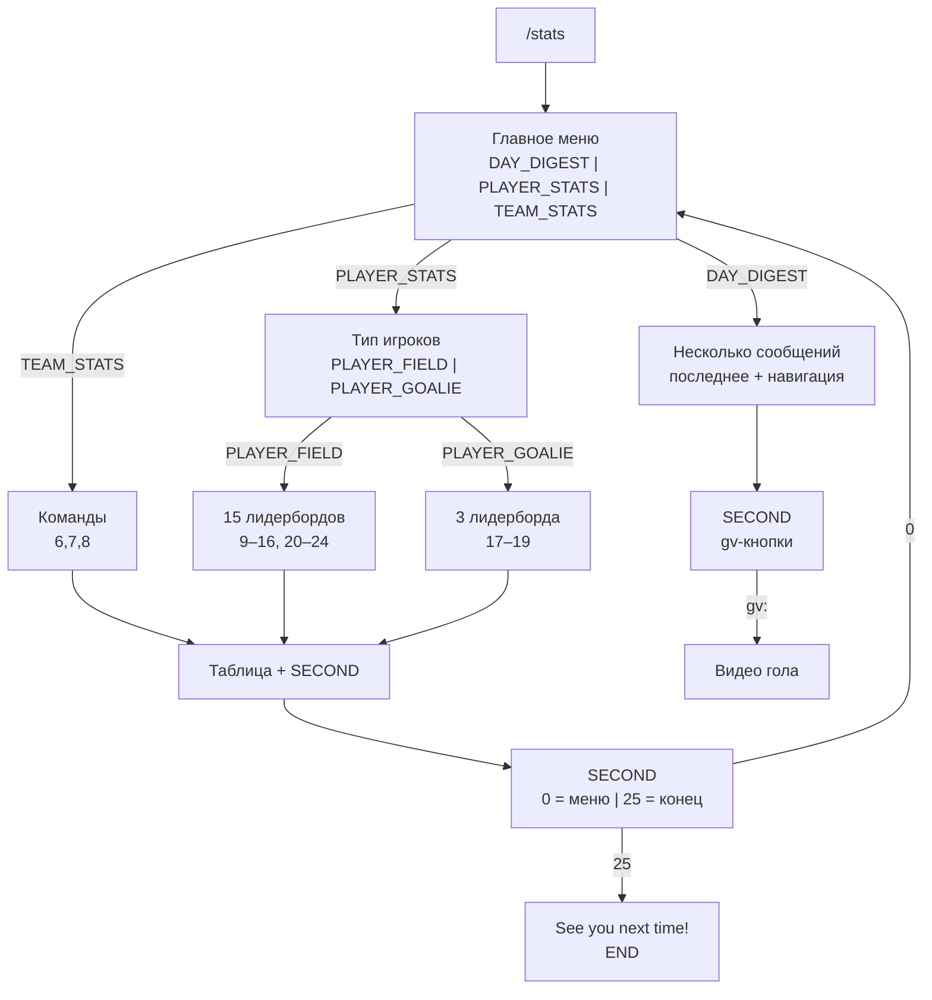

# Путь пользователя: `/stats` (статистика в Telegram-боте)

Документ описывает актуальную схему диалога после расширения `dialog_states` (26 состояний, `range(26)`), связывает кнопки с `callback_data` и фиксирует риск для старых сообщений.

## Состояния ConversationHandler

| Состояние | Константа | Назначение |
|-----------|-----------|------------|
| Entry + после «В главное меню» | `FIRST` | Меню выбора раздела и вложенные меню без показа таблицы |
| После показа статистики / дайджеста | `SECOND` | Таблица или блок игр; доступны «В главное меню», «Нет, с меня хватит», кнопки `gv:…` |

Точка входа: команда `/stats` (`script_bot.stats`) → `FIRST`. Повторный `/stats` в `fallbacks` снова запускает то же меню.

## Карта `callback_data` (числовые идентификаторы)

Значения задаются порядком в `telegram_bot/dialog_states.py` (`range(26)`):

| Значение | Константа | Где кнопка / обработчик |
|----------|-----------|-------------------------|
| 0 | `CHOOSE_STATS` | «В главное меню» на экранах со статистикой → `stats_over` (только в состоянии `SECOND`) |
| 1 | `TEAM_STATS` | Главное меню → `bot_team_stats` |
| 2 | `PLAYER_STATS` | Главное меню → `bot_player_stats` |
| 3 | `DAY_DIGEST` | Главное меню → `bot_day_digest` |
| 4 | `PLAYER_FIELD` | Игроки → `bot_player_field` |
| 5 | `PLAYER_GOALIE` | Игроки → `bot_player_goalie` |
| 6 | `TEAM_PROCENT_WINS` | Команды → `bot_team_procent_wins` |
| 7 | `TEAM_POWER_PLAY` | Команды → `bot_team_power_play` |
| 8 | `TEAM_POWER_KILL` | Команды → `bot_team_power_kill` |
| 9 | `PLAYER_POINTS` | Полевые → `bot_player_points` |
| 10 | `PLAYER_GOALS` | Полевые → `bot_player_goals` |
| 11 | `PLAYER_ASSISTS` | Полевые → `bot_player_assists` |
| 12 | `PLAYER_PLUS_MINUS` | Полевые → `bot_player_plus_minus` |
| 13 | `PLAYER_PENALTIES` | Полевые → `bot_player_penalties` |
| 14 | `PLAYER_HITS` | Полевые → `bot_player_hits` |
| 15 | `PLAYER_BLOCKS` | Полевые → `bot_player_blocks` |
| 16 | `PLAYER_ICE_TIME` | Полевые → `bot_player_ice_time` |
| 17 | `GOALIE_WINS` | Вратари → `bot_goalie_wins` |
| 18 | `GOALIE_PERCENTAGE` | Вратари → `bot_goalie_percentage` |
| 19 | `GOALIE_SHOOTOUTS` | Вратари → `bot_goalie_shootouts` |
| 20 | `PLAYER_SAT_PCT` | Полевые → `bot_player_sat_pct` (Corsi / SAT%) |
| 21 | `PLAYER_USAT_PCT` | Полевые → `bot_player_usat_pct` (Fenwick / USAT%) |
| 22 | `PLAYER_GOALS_FOR_PCT` | Полевые → `bot_player_goals_for_pct` (GF%) |
| 23 | `PLAYER_OZ_START_PCT` | Полевые → `bot_player_oz_start_pct` |
| 24 | `PLAYER_SHOOTOUT_PCT` | Полевые → `bot_player_shootout_pct` |
| 25 | `END_CONVERSATION` | «Нет, с меня хватит …» → `end` (только в `SECOND`) |
| `gv:{game_id}:{event_id}` | — | Видео гола → `handle_goal_video` (только в `SECOND`) |

Обработчики регистрируются в `telegram_bot/bot.py`: все числовые маршруты — в `FIRST`, возврат в главное меню / конец / видео — в `SECOND`.

## Дерево сценариев (от `/stats`)

После любого лидерборда (`stats_handlers._make_stats_handler` и аналоги) пользователь в `SECOND`: одна колонка кнопок — «В главное меню» / «Нет, с меня хватит …» (для вратарей первая подпись — «Хочу выбрать еще одну статистику!», `callback_data` всё равно `0`).

## Валидация согласованности кода

Проверено по репозиторию:

- В `bot.py` в `FIRST` зарегистрированы обработчики для всех констант с `9` по `24` и командных/навигационных веток — совпадает с кнопками в `script_bot.py`.
- Кнопки расширенной статистики в `script_bot.bot_player_field` используют `PLAYER_SAT_PCT` … `PLAYER_SHOOTOUT_PCT`; в `stats_handlers.py` есть соответствующие `bot_player_*`.
- `CHOOSE_STATS` (`0`) обрабатывается только в `SECOND`; в меню `FIRST` кнопок с `callback_data="0"` нет — лишних срабатываний в корне нет.
- Дайджест дня: `bot_day_digest` синхронно шлёт все сообщения и в конце возвращает `SECOND`; кнопки `gv:` обрабатываются только после этого — гонки «клик до смены состояния» в нормальном UX маловероятны.

## Обратная совместимость старых сообщений

До появления пяти новых пунктов меню полевых игроков константа **`END_CONVERSATION` имела значение `20`**. Сейчас **`20` — это `PLAYER_SAT_PCT`**.

Следствия:

- Старое сообщение с «Нет, с меня хватит …» и `callback_data="20"`: если пользователь всё ещё в **`FIRST`**, нажатие откроет **лидерборд Corsi (SAT%)** вместо завершения диалога.
- Если по какой-то причине чат в **`SECOND`**, колбэк `20` **ни одним обработчиком не ловится** — Telegram покажет «часики», поведение может выглядеть как «кнопка не работает».

Рекомендация пользователям: после деплоя не полагаться на inline-кнопки в старых сообщениях; при сбоях снова вызвать `/stats`.

## Что улучшить

1. **Стабильные строковые `callback_data`** вместо сдвигающихся чисел, например `menu:main`, `action:end`, `player:sat_pct`. Тогда добавление пунктов меню не ломает старые кнопки завершения (пока сохраняете те же строки).
2. **Переходный период**: в `FIRST` (и при желании в `SECOND`) добавить обработчик `^20$`, дублирующий `end` или отвечающий текстом «Обновите меню: /stats», чтобы старые «выходы» не превращались в SAT%.
3. **Обработка неизвестного callback** внутри того же `ConversationHandler` (или общий `CallbackQueryHandler`), чтобы отвечать `query.answer("Меню устарело, нажмите /stats")` вместо тихого игнора.
4. **Тест на соответствие меню и `bot.py`**: скрипт или тест, который импортирует `script_bot` и `bot.py` и проверяет, что каждая `str(CONST)` из клавиатур имеет `CallbackQueryHandler` в нужном состоянии (снижает риск рассинхрона при следующих правках).
5. **Мелочи UX**: единый текст после `/stats` и после «В главное меню» («Запустите обработчик…» vs «Выберите статистику»); при желании унифицировать.

---

*Актуально для ветки с `END_CONVERSATION == 25` и шестью новыми метриками полевых игроков в меню.*
